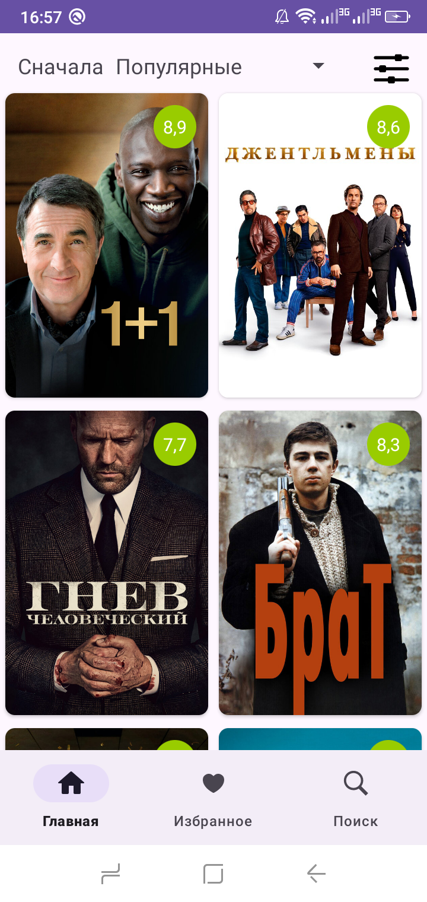
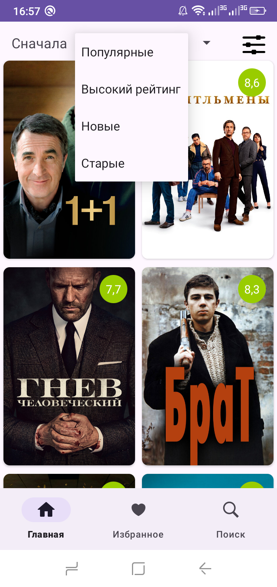
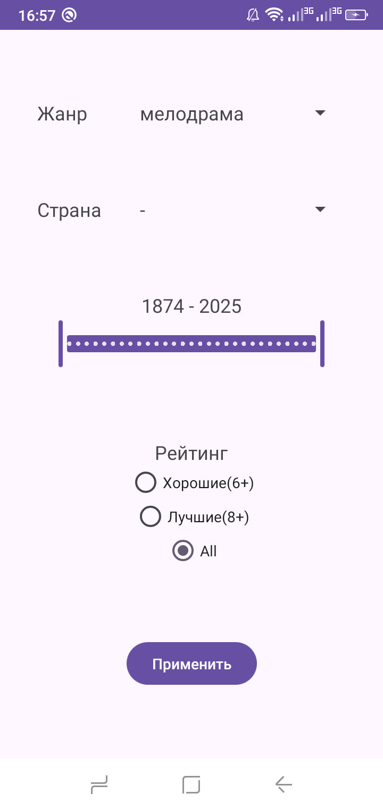
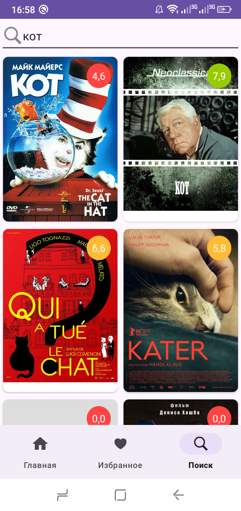
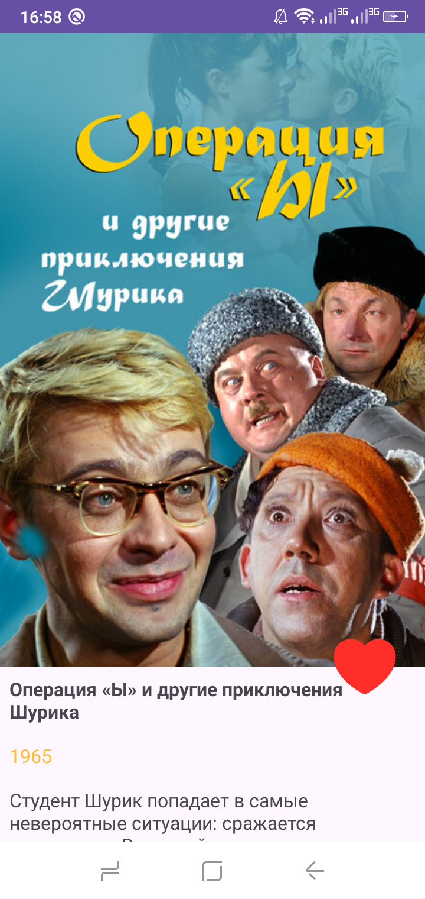
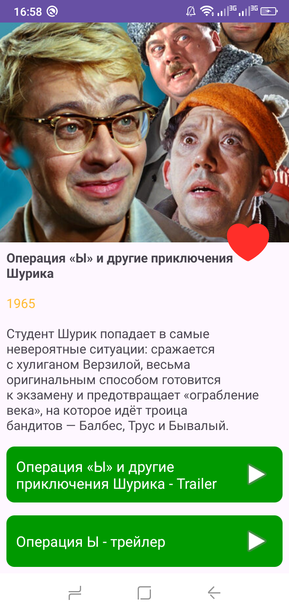

# FilmShelf

Проект для просмотра информации о фильмах.

Стек технологий: Retrofit, Dagger, Glide, Room  
Язык: Kotlin  
CompileSdk: 35  
MinSdk: 24  
TargetSdk: 35  

Для работы с многопоточностью используются корутины.

Данные в приложении загружаются из неофициального API Кинопоиска. При добавлении фильма в избранное вся информация о нём сохраняется в локальное хранилище.

### Токен для API

Для безопасности токена API Кинопоиска используется EncryptedSharedPreferences. Чтобы проект запустился, необходимо наличие в корне проекта файла token.properties, в котором хранится токен.

## Описание приложения

В приложении есть три основных раздела:
- Главная: просмотр списка фильмов, который можно отфильтровать и отсортировать
- Избранное: просмотр списка фильмов добавленных в избранное
- Поиск: поиск фильмов по названию

Другие экраны:
- Экран с детальной информацией, попасть на который можно кликнув по фильму в любом списке
- Экран для настройки фильтров

Фильтры:
- Страна: список стран загружается из API Кинопоиска
- Жанр: список жанров загружается из API Кинопоиска
- Год: выбор диапазона лет между годом самого старого фильма из Кинопоиска и текущим годом
- Рейтинг: все (3-10), хорошие(6-10), лучшие (8-10)

Виды сортировки:
- Сначала популярные
- Сначала высокий рейтинг
- Сначала новые
- Сначала старые

На странице с детальной информацией есть ссылки на трейлеры фильма, при клике по которым происходит переход в приложение для просмотра видео.

  
  
